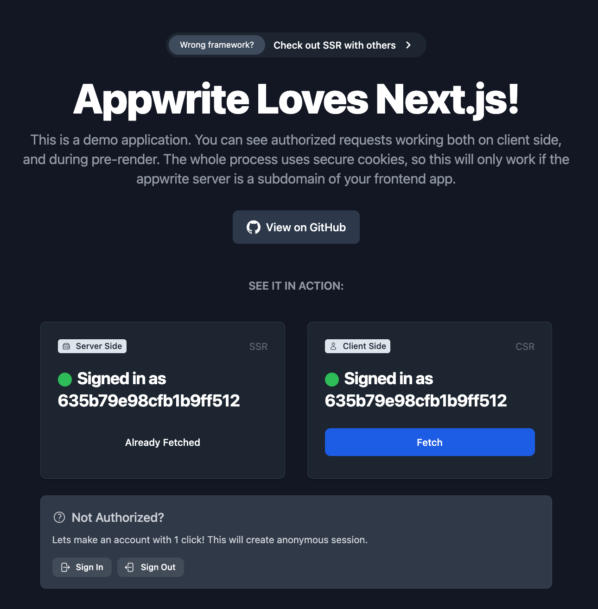
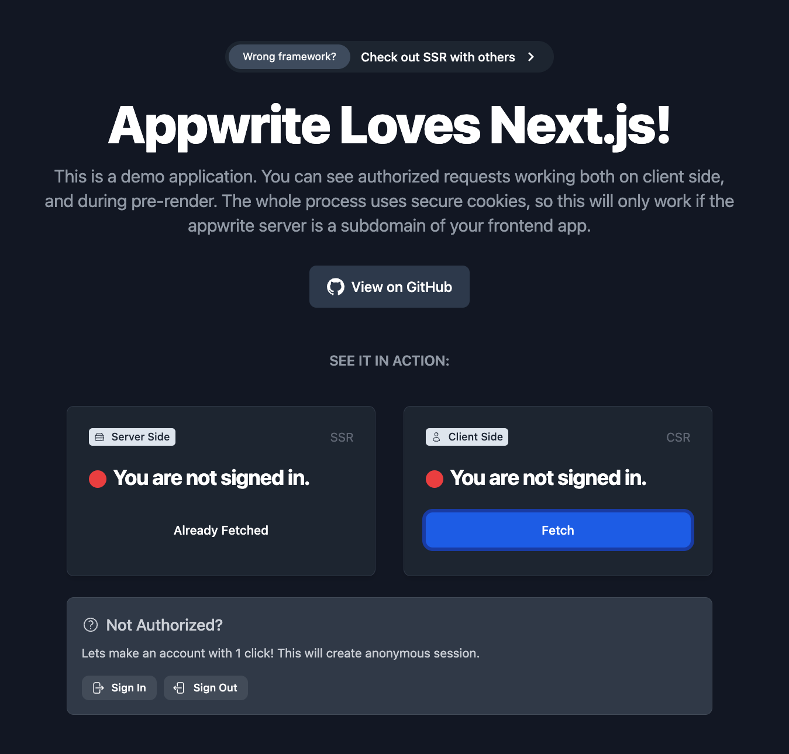

# 🤖 SSR - Appwrite ♥️ Next.js 13

> Demo application showcasing server side rendered authenticated communication between Next.js and Appwrite.

## 🧰 Tech Stack

- [Appwrite](https://appwrite.io/)
- [Next.js 13](https://nextjs.org/blog/next-13)
- [Tailwind CSS](https://tailwindcss.com/)

## ⚙️ Setup Server

1. Setup Appwrite server
2. Create project `appwriteSsr`
3. Deploy Appwrite as subdomain of your app domain, for example `api.myapp.com`

> If running on localhost port 80, you can use `localhost`

4. Update `APPWRITE_ENDPOINT` and `APPWRITE_HOSTNAME` in `lib/appwrite.js`

## 👀 Setup Client

1. Install libarries `npm install`
2. Deploy Next.js app on a domain, for example `myapp.com`

> If running on localhost port 3000, you can use `localhost`

3. Update `APP_HOSTNAME` in `lib/appwrite.js`

4. Start server `npm serve`

5. In Appwrite Dashboard, add your frontend app domain as web platform

## 🖼️ Screenshots




## 🤖 Auto-generated documentation

This is a [Next.js](https://nextjs.org/) project bootstrapped with [`create-next-app`](https://github.com/vercel/next.js/tree/canary/packages/create-next-app).

## Getting Started

First, run the development server:

```bash
npm run dev
# or
yarn dev
```

Open [http://localhost:3000](http://localhost:3000) with your browser to see the result.

You can start editing the page by modifying `pages/index.tsx`. The page auto-updates as you edit the file.

[API routes](https://nextjs.org/docs/api-routes/introduction) can be accessed on [http://localhost:3000/api/hello](http://localhost:3000/api/hello). This endpoint can be edited in `pages/api/hello.ts`.

The `pages/api` directory is mapped to `/api/*`. Files in this directory are treated as [API routes](https://nextjs.org/docs/api-routes/introduction) instead of React pages.

## Learn More

To learn more about Next.js, take a look at the following resources:

- [Next.js Documentation](https://nextjs.org/docs) - learn about Next.js features and API.
- [Learn Next.js](https://nextjs.org/learn) - an interactive Next.js tutorial.

You can check out [the Next.js GitHub repository](https://github.com/vercel/next.js/) - your feedback and contributions are welcome!

## Deploy on Vercel

The easiest way to deploy your Next.js app is to use the [Vercel Platform](https://vercel.com/new?utm_medium=default-template&filter=next.js&utm_source=create-next-app&utm_campaign=create-next-app-readme) from the creators of Next.js.

Check out our [Next.js deployment documentation](https://nextjs.org/docs/deployment) for more details.
